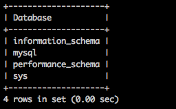
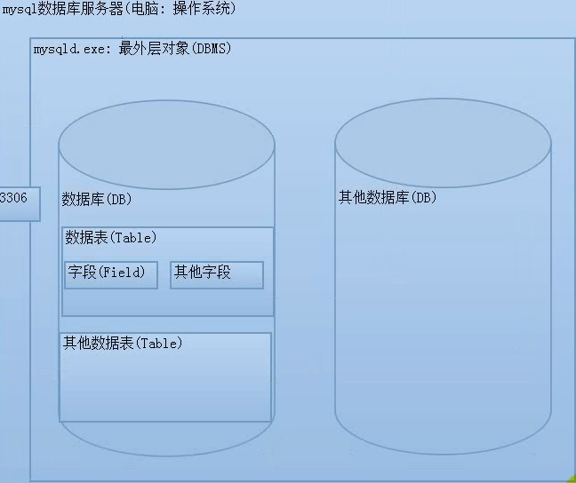

# mysql

>mysql是一种C/S结构的软件。客户端和服务端。服务端一直运行，客户端在需要时运行

交互方式：

1. 客户端连接认证：连接服务器。认证身份。

    

2. 发送sql指令

    

3. 服务端接收指令：出来SQL指令。返回结果。

4. 客户端接收信息。显示结果

    

5. 断开连接（释放资源，服务器并发限制）(exit,quit,q)

## mysql服务器对象

>Mysql 服务器内部对象分成四层：系统（DBMS）—>数据库（DB）—>数据表（Table）—>字段（field）

 

