# SQL基本操作

基本操作:CRUD

根据操作对象将数据库操作分为三类：库操作、表操作（字段）、数据操作

## 库操作

对数据库的增删改查。

### 新增数据库

基本语法： 

```Mysql
create database 数据库名称 库选项
```

>库选项：用来约束数据库，分为两个选项。
>
>1. 字符集设定 charset/character，具体字符集（数据存储编码），常用:GBK，UTF8
>2. 校对集设定：collate 具体校对集合（数据比较的规则）

**数据库名字不能用关键字和保留字**

如果非要使用保留字和关键字。则使用反引号。

```mysql
create database `database` charset utf8;
```

设置中文数据库

```mysql
set names gbk;
create database 中国 utf8;
```

**创建数据库的sql执行之后，发生了什么？**

1. 在数据库系统中，增加了相应的数据库信息。

    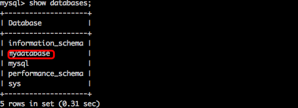

2. 在保存数据库的文件夹下，保存了相应数据库的文件夹。

    

3. 每个数据库下都有一个opt（option）文件。保存了库选项

 

字符集：utf8

校对集：utf8_general_ci,校对集依赖字符集。


### 查看数据库

1. 查看所有数据库

```mySql
show databases;
```

 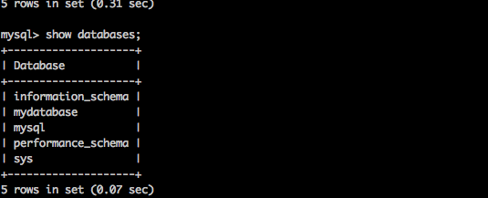

2. 查看指定数据库：模糊查询

```mysql
show databases like 'pattern';		pattern是匹配模式
```

%：匹配多个字符

_:匹配单个字符

```mysql
# 查看以information_开头的数据库。
show databases like 'information\_%';
```

 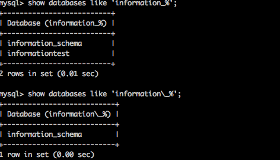

3. 查看数据库创建语句

```mySql
show create database mydatabase;
```

 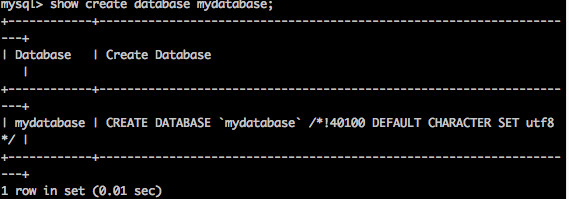

与创建时的语句有所不同是因为mysql进行了优化。

### 更新数据库

数据库名字不可以修改

数据库修改仅限库选项（字符集和校对集）

```mysql
alter database 数据库名 字符集/校对集 库选项;
```

```mySql
alter database informationtest charset GBK
```

### 删除数据库

删除是最简单的

```mysql
drop database 数据库名;
```

```mysql
drop database informationtest;
```

 

发生了什么。

1. 数据库系统中没了该数据库的信息。
2. 文件系统中没了该数据库的相关文件。
3. 重要的数据应该先备份，再删除。


## 表操作

表与字段是密不可分的。

### 新增数据表

```mysql
create table [if not exists] 表名(
 字段名称	数据类型,
 字段名称	数据类型 --最后一行不需要逗号。
)[表选项]
```

**if not exists**:如果表名不存在，那么就创建，否则，不执行代码；检查功能。

**表选项**：控制表的表现

1. 字符集：charset/character set 具体字符集：保证表中数据存储的字符集。
2. 校对集:collate具体校对集。
3. 存储引擎：engine 具体的存储引擎（innodb和myisam）

```mysql
create table if not exists student(
	name varchar(10),
	gender varchar(10),
  	number varchar(10),
  	age int
)charset utf8;
```

 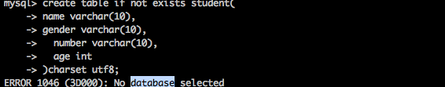

**错误原因**：没有选中数据库。任何一个表的设计都必须指定数据库。

**方案1**：显示的指定所属数据库。

```mysql
create table 数据库名.表名(
字段名称	数据类型,
字段名称	数据类型
)[表选项];
```

```mysql
create table if not exists mydatabase.student( -- 显示的将student表放到mydatabase数据库下。
	name varchar(10),
	gender varchar(10),
  	number varchar(10),
  	age int
)charset utf8;
```

 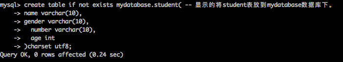

**方案2**：隐式的指定表所属数据库。先进入到某个数据库环境，再在该环境创建表。那么该表就是该数据库的。

**进入数据库**：

```mysql
use 数据库名;
```

```mysql
use mydatabase;
```

```Mysql
create table if not exists class(
name varchar(10),
 room varchar(10)
)charset utf8;
```

 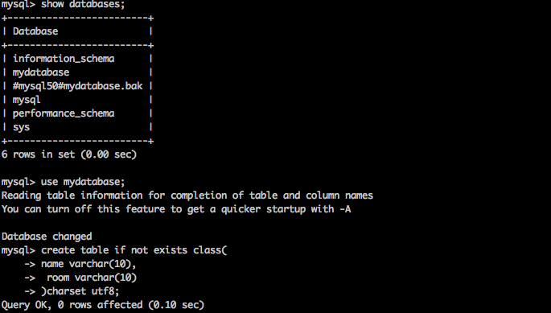

**当创建数据表的sql语句执行后到底发生了什么？**

1. 指定数据库下已经存在对应的表。

    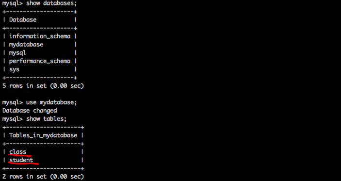

   ​

2. 在数据库对应的文件夹下，会产生对应表的结构文件（跟存储引擎有关）。

 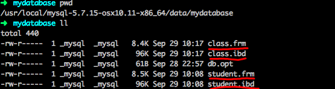

### 查看数据表

数据库能查看的方式，表都能查看。

1. **查看所有表**

```mysql
show databases;
```

 

2. **查看部分表** ：模糊查询

```mySql
show tables like 'pattern'  -- pattern 是匹配规则。
%匹配多个字符
 _匹配一个字符
```

```mysql
show tables like '%s' #匹配以s结尾。
```

 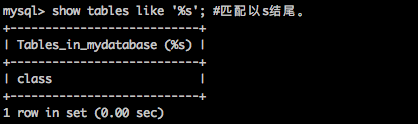

3. **查看表创建语句**

```mysql
show create table 表名;
```

```mySql
show create table student\g		-- \g相当于分号;。
```

 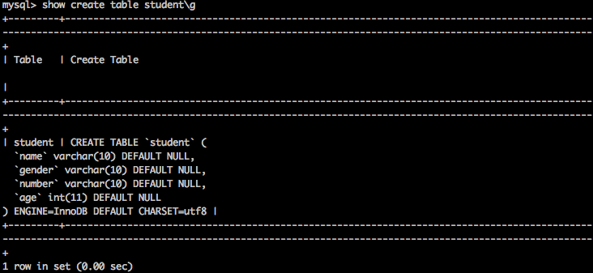

```mysql
show create table student\G				-- \G 将结果旋转显示。
```

 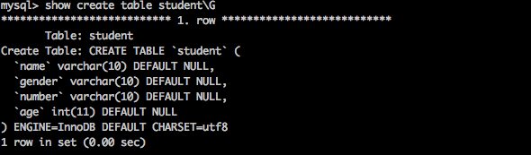

4. **查看表结构**：查看表中的字段信息。

```mysql
Desc/describe/show columes from 表名;
```

 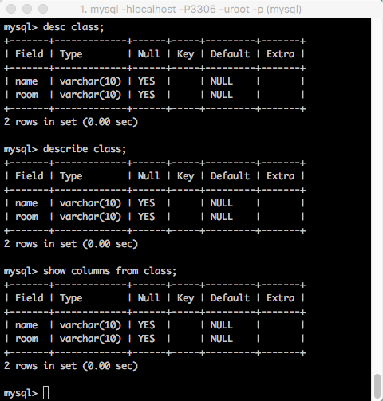


 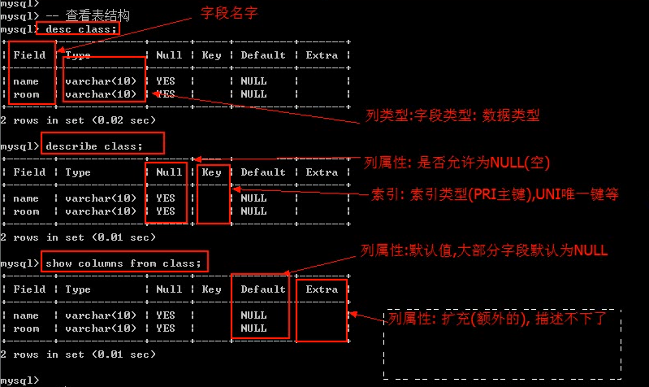

### 修改数据表

表本身存在。还包含字段：表的修改分成两个部分。修改表本身和修改字段。

1. **修改表本身**：表名和表选项

   1.1 **修改表名**：

   ```mysql
   rename table oldtablename to newtablename;
   ```

    

   1.2 **修改表选项**:字符集、校对集、存储引擎。

   ```mysql
   alter table 表名 表选项 [=] 值;
   ```

   ```mysql
   alter table my_student charset = utf8;
   ```

    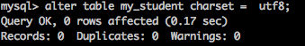

   ​

2. **修改字段**：新增，修改，重名，删除。

   2.1 __新增字段__。

```mysql
alter table 表名 add [column] 字段名 数据类型 [列属性][位置];
```

位置：字段名可以存放表中的任意位置。

first：第一个位置

After：在哪一个字段之后 after 字段名。默认是在最后一个字段之后。

__比如给学生增加一个id，放在第一 个位置。__

```mysql
alter table my_student add column id int first;
```

 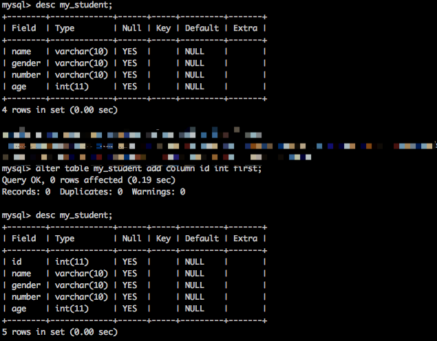

 	2.2 __修改字段__:**修改属性或位置或数据类型**

```mysql
alter table 表名 modifiy 字段名 数据类型 [属性][位置];
```

__将学生表中的学号变成固定长度并放到第二位__

```mysql
alter table my_student modify number char(10) after id;
```

 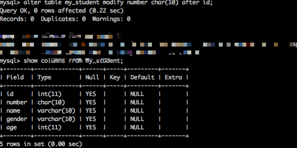

​	2.3 **重命名字段**

```mysql
alter table 表明
change 旧字段名 新字段名 数据类型;
```

```mysql
alter table my_student 
change gender sex varchar(10);
```

 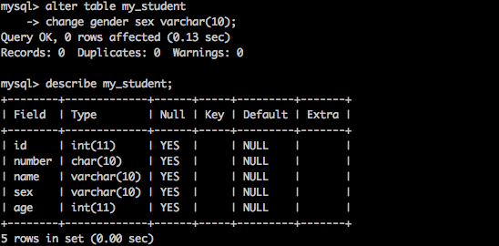

​	2.4 **删除字段**

```mysql
alter table 表名 drop 字段名;
```

**删除学生表中的年龄字**

```mysql
alter table my_student drop age;
```

 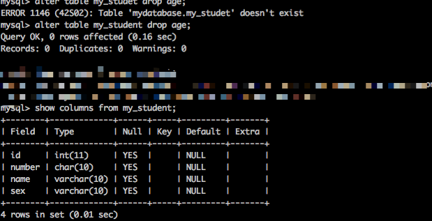

**$删除操作需谨慎$**

### 删除数据表

```mysql
drop table 表名1，表名2；
```

**删除class表**

```mysql
drop table class;  
```

 

$删除操作需谨慎$

## 数据操作

### 新增数据

**有两种方案。**

1. 给全表字段插入数据。不需要指定字段列表。：要求数据的值与表中设计的字段出现的顺序一致。凡是非数值数据，建议都用引号（单引号）包裹。

```mySql
insert into 表名 values(值列表)，[(值列表)]; -- 可以一次性插入多条记录
```

```mysql
insert into my_student values
(2,'fuck002','王八蛋','male'),
(3,'fuck003','乌龟','male'),
(4,'fuck004','雷克赛','female');
```

 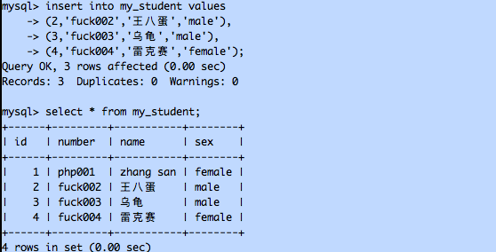

2. 给部分字段插入数据，需要选定字段列表。字段列表出现的顺序与字段的顺序无关。但是值列表的顺序必须与选定的字段顺序一致。

   ```mysql
   insert into 表名(字段列表)  values(字段列表对应的值列表);
   ```

   ```mysql
   insert into my_student(id,name,sex,number) values
   (5,'王宝强','male','fuck005'),
   (6,'马蓉','bitch','fuck006'),
   (7,'宋喆','zazhong','fuck007');
   ```

 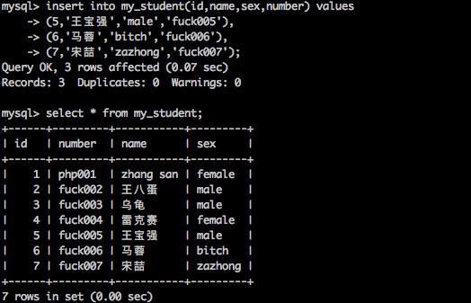

### 查看数据

```mysql
select */字段列表 from 表名 [where条件];
```

1. **查看所有数据**

   ```mysql
   select * from 表名;
   ```

   ```mysql
   select * from my_student;
   ```

    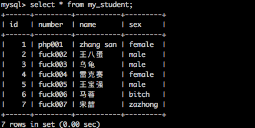

2. **查看指定字段指定条件**

   ```mysql
   select 字段列表 from 表名 [where条件];
   ```

   ```mysql
   select id,name,sex,number from my_student where name like '王%';
   ```

    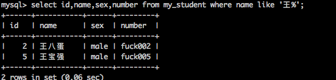

   ​

### 更新数据

```mysql
update 表名 set 字段名=值 [where条件];
```

```mysql
update my_student set sex='female' where name='宋喆';
```

 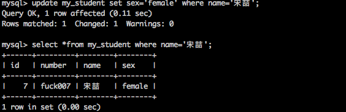

### 删除数据

删除不可逆，操作需谨慎。

```mysql
delete from 表名 [where条件];
```

```mysql
delete from my_student where name='宋喆';
```

 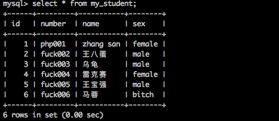


