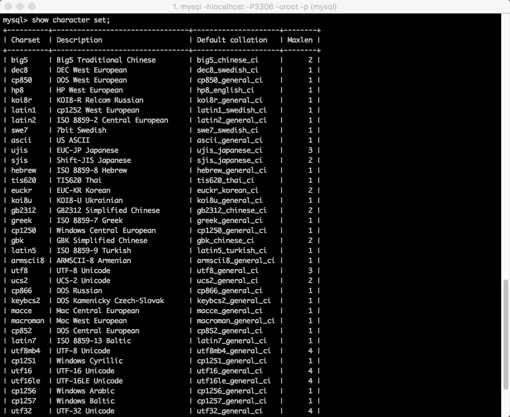
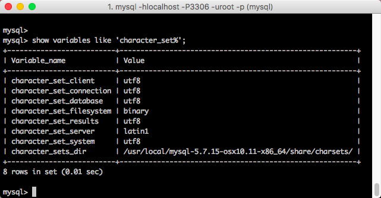
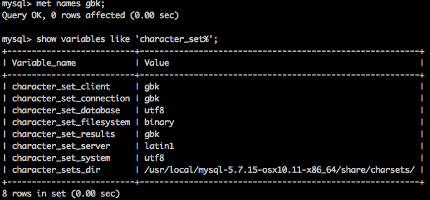
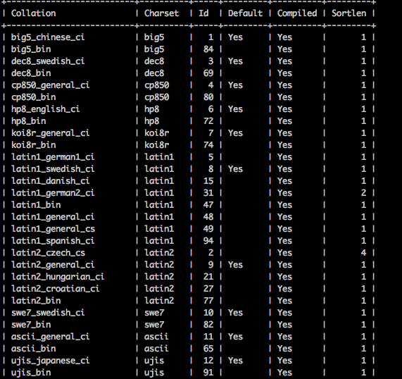
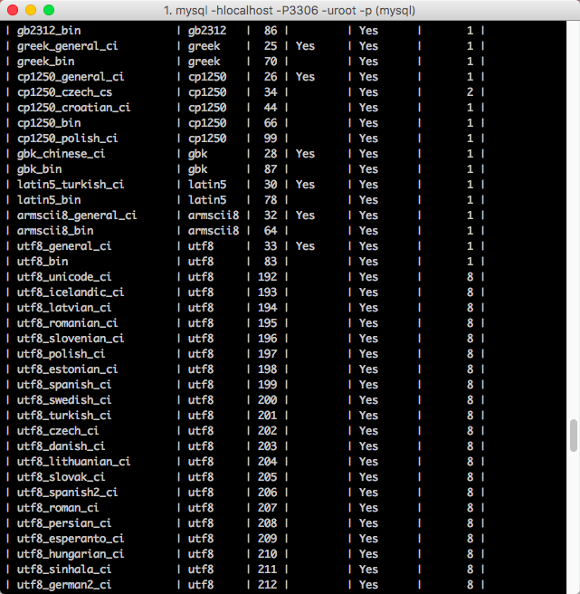
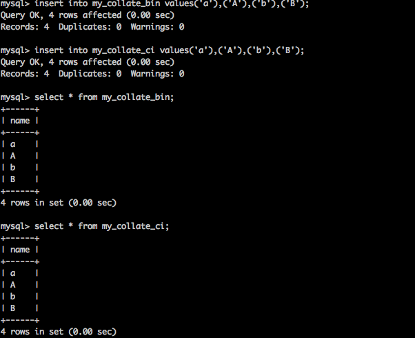
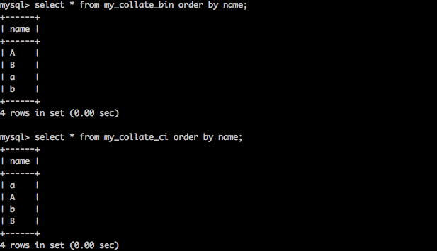

# 中文数据问题

## 字符集

中文数据问题本质就是字符集问题。

计算机只识别二进制。二人类识别字符。所以要建立二进制和字符的对应关系（字符集）

**查看所有字符集**

```mysql
show character set;
```



说明服务器是万能的，什么字符集都支持。

查看服务器默认对外处理的字符集。

```mysql
show variables like 'character_set%';
```

 

1. **Character_set_client utf8**:服务器默认以utf8处理客户端的数据。
2. **Character_set_connection utf8**:连接层字符集
3. **character_set_database**:当前所在数据库字符集。
4. **character_set_results**:服务器默认返回给外部的数据字符集。

**修改服务器对客户端数据处理的字符集**

```mysql
set character_set_client=utf8;
```

**修改服务器给客户端的数据字符集**

```Mysql
set character_set_results=utf8;
```

**_set 变量=值_**:只在当次连接有效。（会话级别）


**设置服务器对客户端的字符集的认知可以用快捷方式。**

```Mysql
set names utf8;
```

 


## 校对集

数据比较的方式。

校对集有三种方式。

1. **_bin**:binary,二进制比较，取出二进制位，一位一位比较，区分大小写。
2. **_cs**:case sensitive,大小写敏感。
3. **_ci**:case insensitive,大小写不敏感。

**查看所有的校对集**

```mysql
show collations ;
```

 

 

#### 校对集的应用

只有数据产生比较的时候校对集才会产生作用。

**实例**

1. 创建表使用不同的校对集。

   ```mysql
   create table my_collate_bin(
   name char(1)
   )charset utf8,collate utf8_bin; 
   ```

   ```mysql
   create table my_collate_ci(
   name char(1)
   )charset utf8,collate utf8_general_ci; 
   ```

2. 插入数据

   ```mysql
   insert into my_collate_bin values('a'),('A'),('b'),('B');
   insert into my_collate_ci values('a'),('A'),('b'),('B');
   ```

    

3. 比较:根据某个字段进行比较。**order by 字段名 [asc/desc]** asc升序（默认），desc降序。

   ```mysql
   select * from my_collate_bin order by name;
   select * from my_collate_ci order by name;
   ```

    

**有数据后修改校对集，修改无效**。


 web乱码解决：php，mysql，browser。


