# 数据类型

所谓的数据类型是对数据进行统一的分类。从系统的角度出发，是为了能够使用统一的方式进行管理，更好的利用空间。

SQL数据类型：数值类型，字符串类型，时间日期类型。

## 数值型

数值型数据都是数值。

系统又分为整形和小数型。

### 整形

整形又分为5类。

1. __Tinyint__  ：一个字节存储，表示的状态有256种
2. **_Smallint_** ：2个字节存储。表示状态65536中。
3. **_Medium_** ：3个字节存储。
4. **_Int_** ：标准整形。4个字节存储。
5. **_Biting_** ：8个字节存储。

**创建一张整形表**

```mysql
-- 创建整形表
create table my_int(
int_1 tinyint,
int_2 smallint,
int_3 mediumint,
int_4 int,
int_5 bigint
)charset utf8;
```

 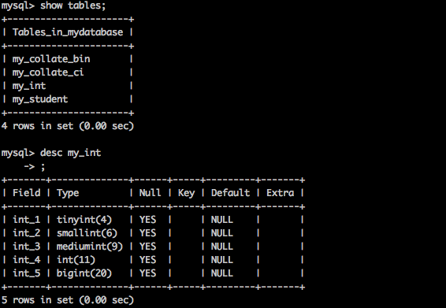

**插入数据**

```mysql
-- 插入数据
-- 正常插入
insert into my_int values(100,100,100,100,100);
-- 无效数据类型限定
insert into my_int values('a','b',100,'f');
-- 超出范围
insert into my_int values(255,10000,1000,100,10000);
```

 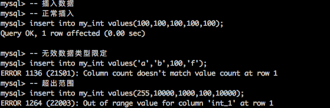

**SQL中数据默认都是有符号的**。

**_给表增加一个无符号类型_**

```mysql
-- 给表增加一个无符号类型。
alter table my_int add int_6 int unsigned;
```

```Mysql
-- 插入数据
insert into my_int values(127,100,100,1000,10000,255);
```

 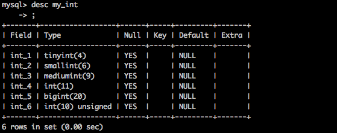

 **显示宽度**:没有特别的含义。不能改变数据大小。当数据不够显示宽度时，会自动让数据变成对应的显示宽度。零填充会让数值变成无符号数。

 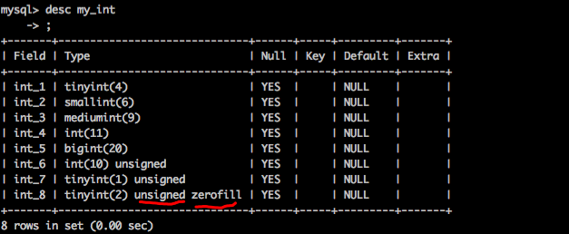

零填充的意义： 保证数据的格式。

### 小数型

带有小数点或者说超出整形的表示范围的类型。

sql中：浮点型和定点型。

浮点型：小数点浮动。精度有限，丢失精度。

定点型：小数点固定。精度固定，不会丢失精度。

#### 浮点型

精度型数据类型。超出范围会丢失精度（4舍去5入）

浮点型又分为两种。

① float :单精度，占用4个字节精度范围大概为7位左右。

② double：双精度。占用8个字节，精度范围为15位左右。 

**创建浮点数表**。float(M,D),m代表总长度。d代表小数长度。

```mysql
-- 创建浮点数表
create table my_float(
f1 float,
f2 float(10,2), -- 10位在精度范围之外
f3 float(6,2)	-- 6位精度范围之内。
)charset utf8;
```

插入数据：可以是直接小数，也可以用科学技术。

```mysql
-- 插入数据。
insert into my_float values(1000.10,1000.10,1000.10);
insert into my_float values(9999999999,99999999.99,9999.99); -- 最大值。
insert into my_float values(3e38,3.01e7,1234.56); -- 最大值。
```

浮点型数据插入。整形部分不能超出长度。而小数部分可以超出。

 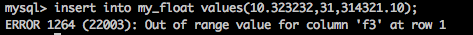

 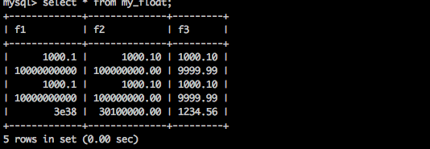

#### 定点型

绝对地保证整数部分不丢失精度。理论上小数部分也不丢失精度。

创建定点表。

```mysql
-- 创建定点表
create table my_decimal(
f1 float(10,2),
d1 decimal(10,2)
) charset utf8;
```

-- 插入数据 定点数整数部分不能超出范围。小数部分可以。

```Mysql
insert into my_decimal values(12345678.90,12345678.90); -- 有效数据
insert into my_decimal values(1234.123456,1234.123456789); -- 小数不封超出，可以。
insert into my_decimal values(12345678.99,12345678.99);
insert into my_decimal values(99999999.99,9999999.99); -- 没有问题
insert into my_decimal values(99999999.99,99999999.999); -- 进位 超出范围
```

```mysql
-- 查看warings 
show warnings;
```

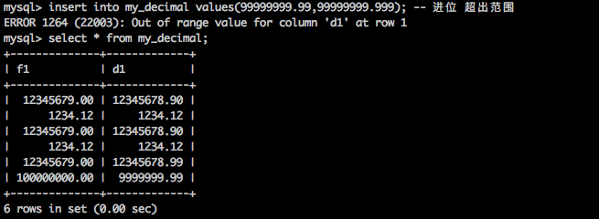

### 时间日期格式 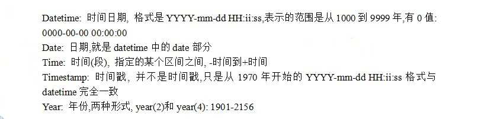 

 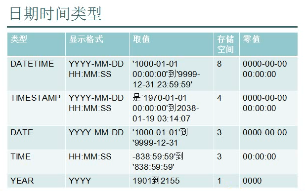

创建时间日期表

```mysql
create table my_date(
d1 datetime,
d2 date,
d3 time,
d4 timestamp,
d5 year
)charset utf8;
```

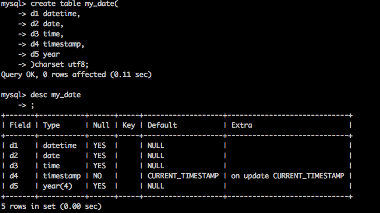

time可以是负数，表示时间段。

```mysql
-- 插入数据
insert into my_date values
	('2016-10-04 15:46:55',
	'2016-10-04','15:47:25',
	'2016-10-04 15:47:48',
	'2016');
```

 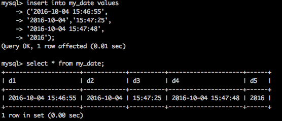

Timestamp 特点：只要当条记录被修改。则timestamp会修改为当前时间（数据修改时的时间）。

 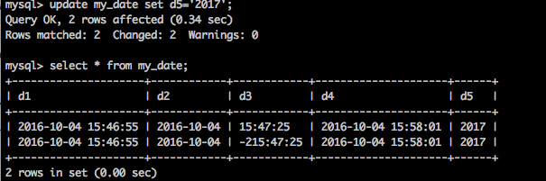

真正的时间戳。

```mysql
select unix_timestamp();
```

 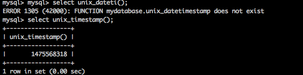

## 字符串类型

sql中有6中字符串类型。

 Char,varchar,text,blog,enum,set。

1. char：定长字符串 char(L),L length, char(4) 在utf-8下需要4x3=12个字节。

2. varchar: 变长字符串。在分配空间时，按照最大的空间分配。但是具体用了多少，要根据具体的数值确定。varchar(L) L表示长度，最多存储65536 个字符。会多出1到2个字节来确定实际存储的长度。

   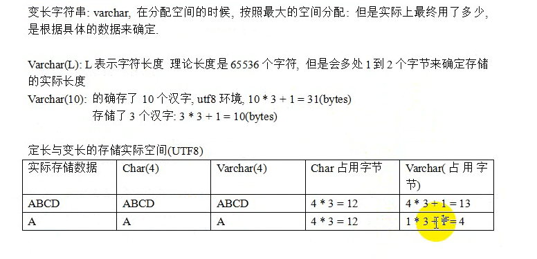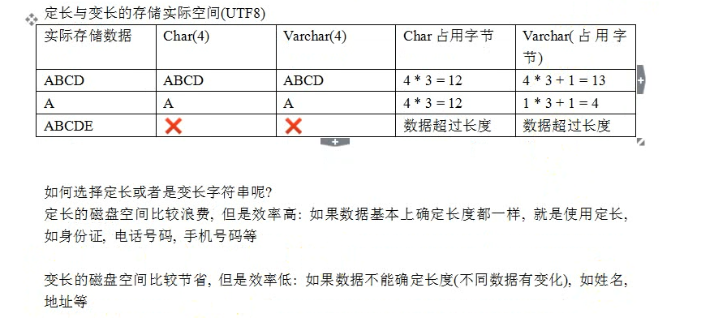

   

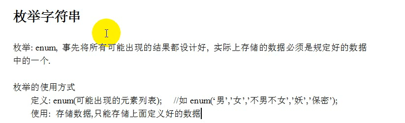

**创建枚举表**

```mysql
create table my_enum(
  gender enum('男','女','不男不女','妖','保密')
)charset utf8;
```

插入数据，数据只能是规定数据中的一个。

```mysql
insert into my_enum values('男')；
insert into my_enum values('male');
```

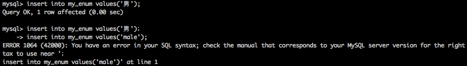

 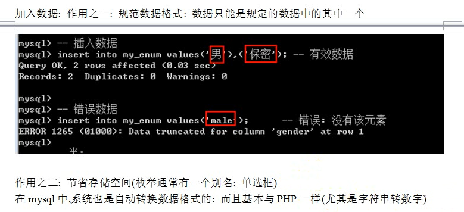

 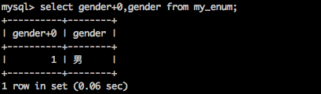

枚举存储的实际内容是数值。 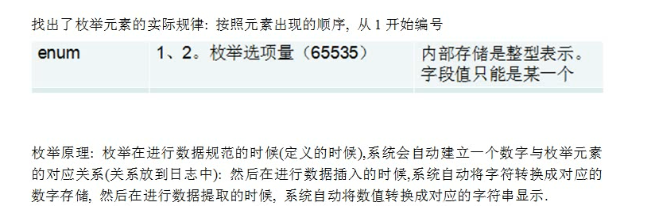

#### 集合字符串

集合和枚举很类似。实际存储的是数值。而不是字符串。它是多选。

set(元素字符串)

创建集合表

```mysql
create table my_set(
hobby set('篮球','足球','乒乓球','台球','羽毛球')
)charset utf8;
```

插入数据，可以用多个字符串。也可以直接插入数值。

```mysql
insert into my_set values(3); -- 3=1+2 等于篮球+足球
insert into my_set values('篮球,羽毛球');
```

 

 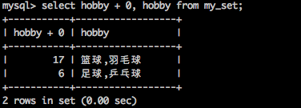

集合中每一个二进制位，被选中为1，为选中为0。 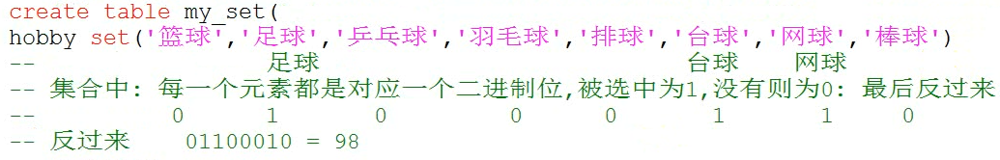

 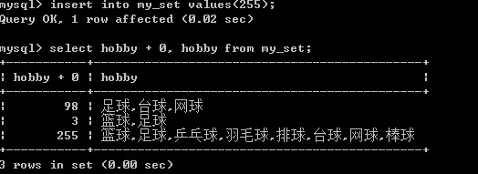

集合无关顺序。

### 记录长度

mysql规定任何一条记录最长不能超过65535个字节。(varchar永远达不到理论值)

 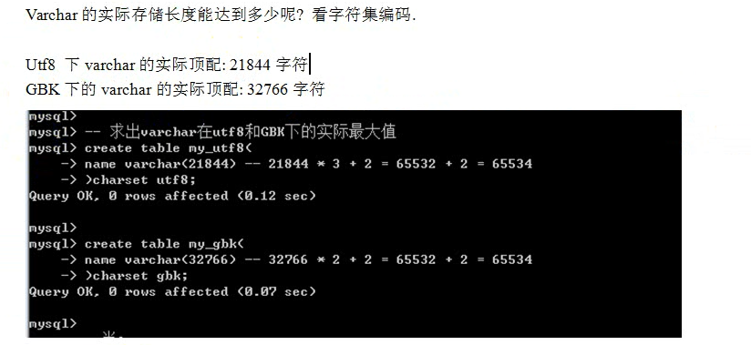

 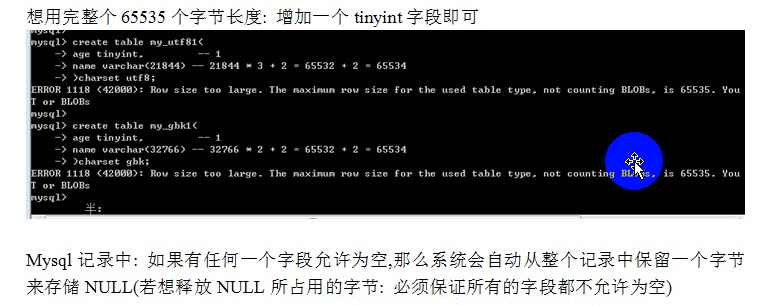

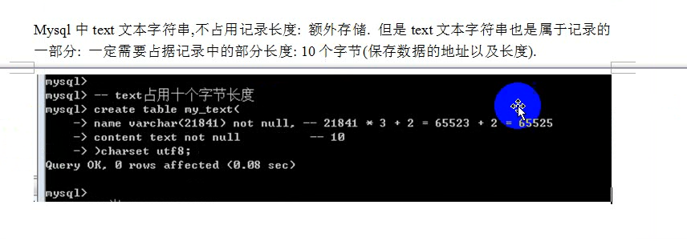

## 列属性

真正约束字段的数据类型。约束很单一，需要一些额外的约束来保证数据的意义。

列属性有很多

null，not null，default，primary key，unique key，auto_increment,comment.

1. Null (默认为空) ，not null（不为空）

#### 列描述

Comment 专门用来描述字段的。但不是注释。会根据表创建语句保存。

```mysql
create or replace table my_teacher(
  name varchar(20) not null comment '姓名',
  money decimal(10,2) not null comment '工资'
)charset utf8;
```

 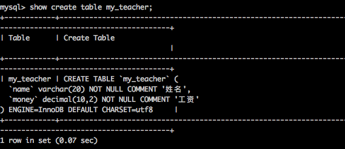

##### 默认值

```mysql
create table my_default(
name varchar(20) not null,
age tinyint unsigned default 0,
gender enum('男','女','保密') default '男'
)charset utf8;
```

```mysql
insert into my_default(name) values('高强');
insert into my_default values('呵呵',18,default);
```

 