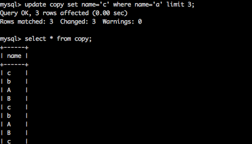

# 高级操作

## 新增数据

基本语法:

```mysql
insert into 表名(字段列表) values(值列表);
```

在数据插入的时候，假设主键对应的值已经存在。插入一定会失败。

### 主键冲突

当主键存在冲突的时候，我们可以选择性的处理。更新和替换。

主键冲突：更新操作

```mysql
insert into 表名(字段列表：包含主键) values(值列表) on duplicate key update 字段=新值;
```


主键冲突：替换操作

```mysql
replace into 表名(字段列表：包含主键) values(值列表);
```

 

### 蠕虫复制

从已有数据中获取数据，然后又进行新增操作，数据成倍增加。

1. 表创建的高级操作。从已有表创建新表。 只复制表结构。

```mysql
create table 表名 like 数据库.表名;
```

2. 先查出数据，然后将查出的数据新增一遍。

   ```Mysql
   insert into 表名(字段列表) select (字段列表) from 表名;
   ```

```mysql
create table 表名 select (字段列表) from 表名;
```


蠕虫复制的意义

1. 从已有表拷贝数据到新表中
2. 可以快速地将表的记录扩展到一定的数量级。

### 高级更新

基本语法

```mysql
update 表名 set 字段 = 值[where条件];
```

 高级语法

```mysql
update 表名 set 字段 = 值[where条件] [limit]; -- 限制更新数量
```

 

**limit** :设置受影响印象。

删除对自增长无影响。

清空表：重置自增长

```mysql
truncate 表名;
```

### 高级查询

基本语法

```Mysql
select */[字段列表] from 表名 [where];
```

高级语法

```mysql
select[select选项] 字段列表[字段别名]/* from 数据源 [where条件子句] [group by子句] [having子句]
[order by]子句 [limit子句];
```

**select选项**

1. all 默认的，保留所有结果。
2. distinct，去除重复。将重复项去除（所有字段都相同）。

 

**字段别名**

当数据查询出来的时候，有时候名字不一定满足需求（或者多表查询出现字段重名），这时需要设置字段重名。

```mysql
字段名 [as] 别名;
```

 

**数据源**

数据的来源，本质上只要保证是类似二维表，那么可以作为数据源。

单表数据源

```mysql
select * from 表名;
```

多表数据源

```Mysql
select * from 表名1，表名2，表名3;
```

笛卡尔积：交叉连接。笛卡尔积没什么卵用，应该尽量避免。

**子查询**：

```mysql
select * from (select语句);
```

**where子句**

用来判断数据，筛选数据。

where子句返回结果：0或者1，0代表false，1代表true；

判断条件：运算符：>,<,>=,<=,!=,<>,=,like,between and, in/not in;

逻辑运算符：&&（and), ||(or), !(not).

**group by子句**

基本语法

```mysql
group by 字段名;
```

count()统计分组后的记录数

Max()最大值

min()最小值

avg()平均值

sum()统计和

 

count可以有两种参数，*和字段名。null不参与统计。

多字段分组。

回溯统计：with rollup;

**having子句**

where是针对磁盘数据进行判断，而having是在数据进入内存之后起作用。

having能做where能做所有的事情。而where不能做having能做的所有事情。

分组之后的数据只有having能操作。

求出所有班级人数大于2的学生人数。 

 

##### order by子句

依赖校对集进行排序

order by 字段名 asc/desc. 

​           

多字段排序，先按某一字段排序，再按照另一个字段排序。

 

**limit子句**

限制结果的子句

方案一、只用来限制数据量。limit 数值;

 

方案二、限制长度。范围.分页效果。

 

提高相应效率。减少资源浪费。