# view-sequence-procedure

## 视图

View：视图是一种是一种由结构(二维表结构，有行有列)但是没结果(结构中不真实存在数据)的虚拟表。 数据表的数据来源不是自己定义，而是从对应的基表中产生( 视图的数据来源)。

#### 创建视图

基本语法

```mysql
create view 视图名字 as select 语句; -- select语句可以是普通查询 可以是连接查询，可以是联合查询，可以是子查询
```

```mysql
create table if not exists my_student(
id int primary key auto_increment,
name varchar(20),
age tinyint
)charset utf8;
```

````mysql
insert into my_student(name,age) values
('sheer',23), 
('go',25), 
('letjinxgo',18), 
('misaya',19), 
('ackleman',17);
````

**创建视图**

```mysql
create or replace view my_v1 as select *from my_student;
```

```mysql
create or replace view my_v2 as select *from my_class;
```

```mysql
create or replace view my_v3 as select s.* c.c_name c.room from my_student as  s left join my_class as c on s.id = c.id;
```

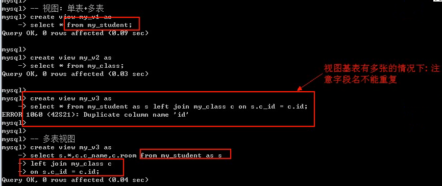

#### 查看视图

查看视图的结构，视图是一张虚拟表。表的所有查看方式都适用于视图。

```mysql
show tables; desc 视图名。show create table/view 视图名；
```

视图和表区别：view和table关键字。

 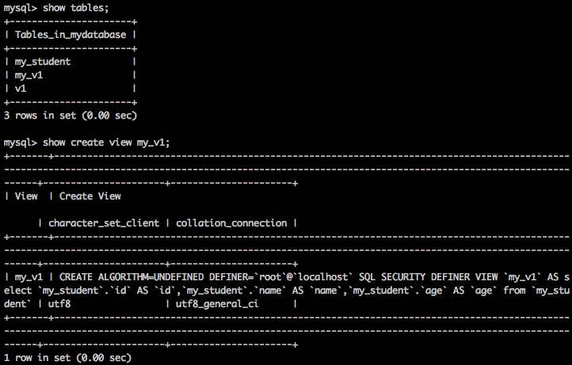

```mysql
alter table my_student add gender varchar(10) after age;
```

```Mysql
alter table my_student add classname varchar(20) after gender;
```

```mysql
update my_student set gender='male',classname='php1001' where id = 3;
```

```mysql
create table if not exists my_class(
  id int primary key auto_increment,
  classname varchar(20),
  classroom varchar(20)
)charset utf8;
```

```mysql
create table if not exists my_teacher(
  id int primary key auto_increment,
  name varchar(20),
  age tinyint,
  gender varchar(10),
  classroom varchar(20)
)charset utf8;
```

```mysql
insert into my_class(classname,classroom) values
('go1001','A101'),
('php1001','B213'),
('php1002','B215'),
('java1001','A113');
```

```mysql
alter table my_teacher change classroom classname varchar(20);
```

```mysql
insert into my_teacher(name,age,gender,classname) values
('韩顺平',38,'male','php1002'),
('毕向东',41,'male','java1001'),
('无闻',28,'female','go1001'),
('陆雪琪',18,'male','java1001'),
('李彦辉',34,'male','php1001');
```

```mysql
create view my_v2 as select * from my_class;
```

```mysql
create view my_v3 as select * from my_teacher;
```

```mysql
create or replace view my_v4 as select s.*,c.classroom from my_student as s left join my_class as c on s.classname=c.classname;
```

 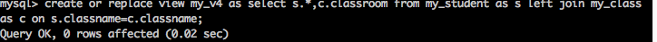

#### 使用视图

视图是零库存的经销商，

```mysql
select * from my_v1;
select * from my_v2;
select * from my_v3;
select * from my_v4;
```

 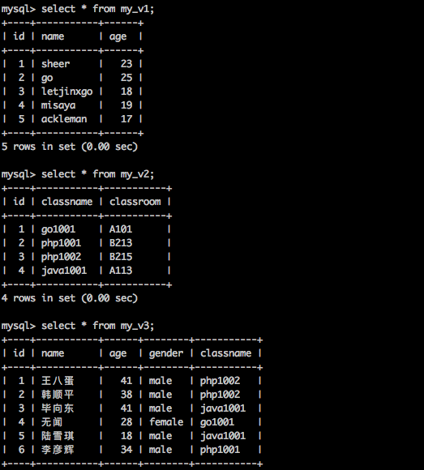

 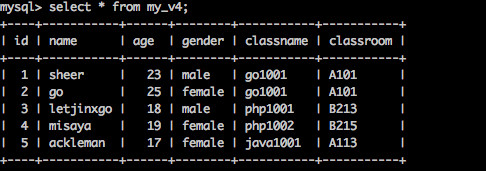

视图的执行，本质就是执行封装的select语句。

#### 修改视图

视图本身不可修改，不过视图的来源是可以修改的。 

修改视图：修改视图本身的来源语句。

```mysql
alter view 视图名 as 新的select语句;
```

```mysql
alter view my_v1 as select name,age,gender as sex,classname from my_student;
```

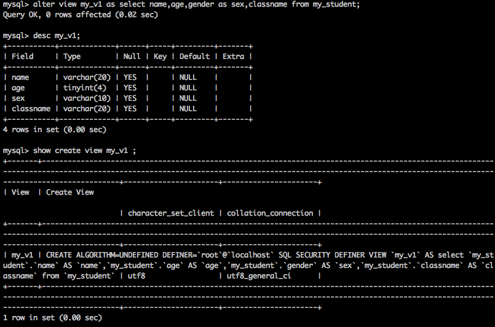

#### 删除视图

```mysql
drop view 视图名;
```

```mysql
drop view my_v1;
```

 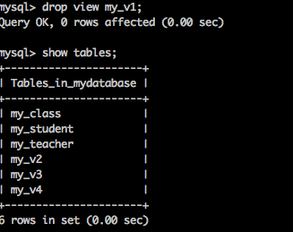

#### 视图意义

1. 节省sql语句，将一条复杂的sql语句使用视图进行存储。以后可以直接对视图进行操作。
2. 数据安全。视图操作主要是针对查询的，如果对视图结果处理（删除），不会影响基表的数据。
3. 视图往往是在大项目和多系统中使用。可以对外提供有效有用的数据。保证数据安全。
4. 视图可以对外提供友好型。不同的视图提供不同的数据，对外好像专门设计。
5. 视图可以更好的进行权限控制。

#### 视图数据操作

视图的确可以进行数据写操作，不过限制较多。

将数据直接在视图上进行操作。

##### 新增数据

1. 不能往多表视图插入数据。

   ```mysql
   insert into my_v4 values
   (6,'hehe',23,'male','php1002','B215');
   ```

    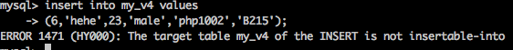

2. 可以向单表中插入数据，但是视图必须包含基表中所有不能为空或没有默认值的字段。

   ```mysql
   insert into my_vi values (6,23,'male','go1001');
   ```

    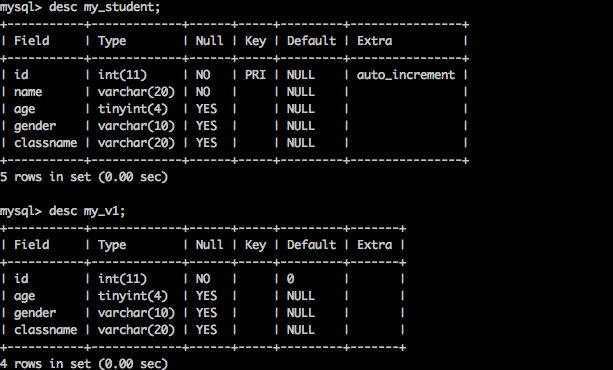

 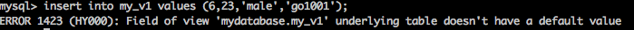

3. 满足条件1和2是可以插入数据的。

```mysql
insert into my_v2 values (5,'javascript1001','C109');
```

 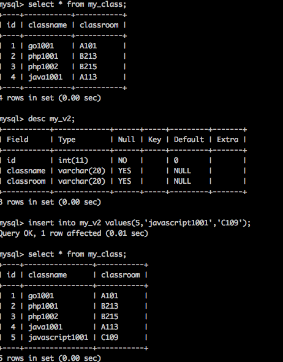

##### 删除视图

1. 多表视图不能删除。

   ```mysql
   delete from my_v4 where id=1;
   ```

    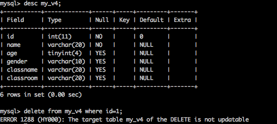

2.  单表视图可以删除数据

   ```mysql
   delete from my_v2 where id = 1;
   ```

    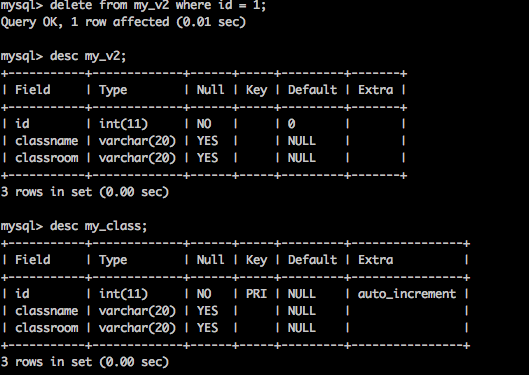

   ​

##### 修改数据

理论上不论单表还是多表都可以更新数据。

更新限制：with check option。如果在对视图进行新增的时候对某一字端进行了限制，那么在更新视图时候会进行限制。要保证更新之后数据依然会被视图查询出来。否则不让更新。

```mysql
create view my_v5 as select * from my_student where age<20 whth check option; -- age字段加了限制。
-- 视图得到的数据更新时候不能将age改为大于20。
```

```mysql
update my_v5 set age = 25 where id = 3;
```

 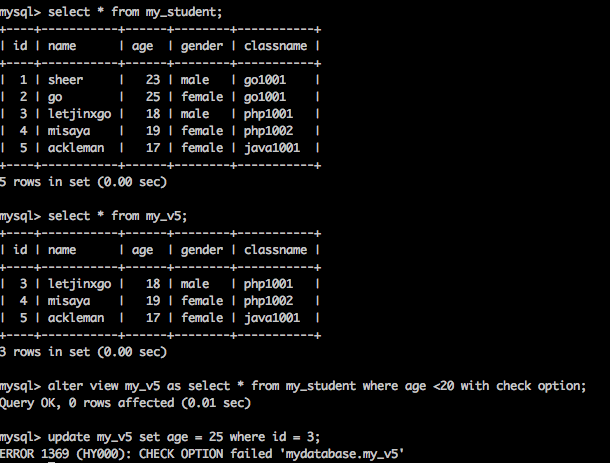

#### 视图算法

系统对视图以及外部查询视图的select语句的一种解析方法。

视图算法分为三种

1. undefined 未定义。这是一种推卸责任的算法。告诉系统没有定义算法。系统自己看着办。
2. temptable 临时表算法。系统应该先执行视图的select语句，再执行外部查询语句。
3. merge。合并算法。系统应该先对视图对应的select语句与外部查询语句进行合并。然后执行。（效率高，常态）

算法指定，在创建视图的时候

```mysql
create algorithm = 算法 view 视图名字 select 语句;
```

```mysql
create or replace algorithm = temptable view my_v6 as select * from my_student order by age asc;
```

 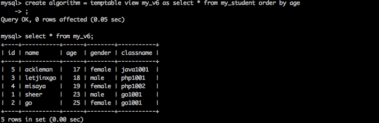

```mysql
select * from my_v6 group by id desc;
```

 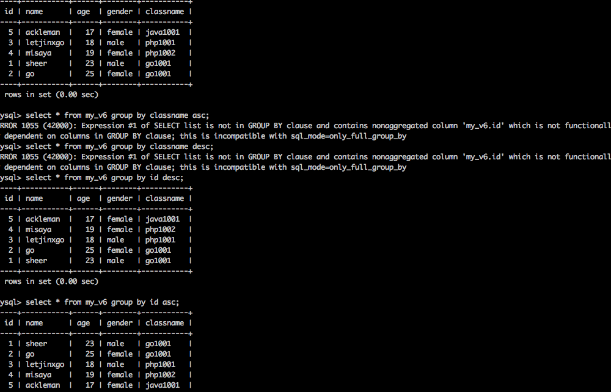

如果视图的select语句语句包含一些字句（while group by order by having limit)(五字句);而且里面的比外部要靠后，比如里面是ordre by，外部是group by。需要指定temptable。其他默认即可。