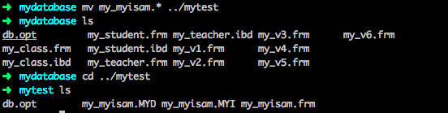

# data-resume

## 数据备份和还原

备份：将当前已有的数据和记录保留

还原：将已经保留的数据恢复到对应表中。

为什么做备份还原？

1. (恢复)防止数据丢失被盗，误操作。
2. (保留)保护数据记录，

数据还原备份的方式有很多种，数据表备份，单表数据备份，sql备份，增量备份。

### 数据表备份

不需要通过sql来备份。直接进入到数据库文件夹，复制对应的表结构以及数据文件，还原的时候，直接将备份的内容还原回去。

数据表备份有前提条件，根据不同的存储引擎有不同的区别。

存储引擎：mysql进行数据存储的方式，主要是两种，innodb和myisam（免费）。

对比myisam和innodb

Innodb：只有表结构，数据全部存储到ibdata1文件中。

myisam：表、数据和索引全部单独分开存储。

```mysql
-- 创建myisam表
create table my_myisam(
  id int
)charset utf8 engine myisam;
```

 

这种文件备份通常适用于myisam存储引擎。直接复制三个文件即可。

 

 

文件移到mytest数据库文件夹后，mytest数据库出现了出现了myisam表。

 

再移动回去

 

表又回来了。

 

**myisam数据表不依赖于特定的数据库，只要是把三个文件移到某个数据库下就能使用。**

**innodb不支持这种方式**

### 单表数据备份

每次只能备份一张表：只能备份数据（表结构不能备份）。

通常的使用：将表中的数据导出到文件。

1. 从表中选出一部分数据保存到外部文件中（outfile）。

   ```mysql
   select */数据列表 into outfile from 数据源;
   -- 前提是外部文件不存在
   ```

   ```mysql
   select * into outfile /usr/local/mysql-5.7.15-osx10.11-x86_64/data/tmp/my_student.txt from my_student;
   ```

   ​

